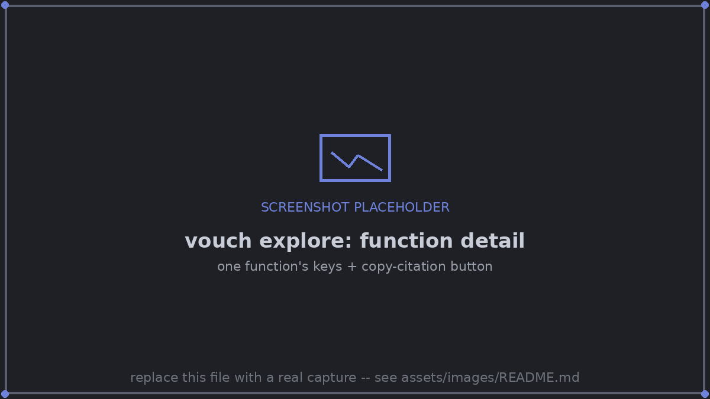

# Inspect: explore, search, cite, ls, trace, document, status, todo

## `vouch explore`

Browse recorded values in a local web page; copy the LaTeX that cites them.

```console
$ vouch explore [--port N] [--open] [--html FILE] [--json] [--root DIR]
```

| Flag | Meaning |
|---|---|
| `--port N` | port on 127.0.0.1 (default 8765) |
| `--open` | open it in the browser |
| `--html FILE` | write a self-contained snapshot instead of serving |
| `--json` | print the data the page shows |

```console
$ vouch explore --open
```


*Values grouped the way the code is: script → function → key, with a
copy-citation button on every row.*


*Clicking a row opens its provenance: description, call, per-seed results, and
where it's cited.*

The page serves at `http://127.0.0.1:8765/` and:

- **Groups** tracked values under their function, recorded values under the function the call is in (or "top level"), parameters in their own group, and derived values under their definition.
- **Copies** citations: `\vouch{key}` for a value, `\vouchclaim{key}{desc}` for a claim, `\vouchtable{key}` for a table (plus a whole `tabular` around it), `\includegraphics[...]{...}` for a figure.
- **Searches** keys, descriptions, function names, function docstrings, call arguments and values (press `/` to focus). Filters show all, cited, or not-cited keys.
- **Shows context**: under a function's header, if it has a docstring, its first line shows underneath -- read fresh from the current source, never something vouch invents.
- **Updates live**: it checks every two seconds whether anything it shows has changed.
- **Stays local and read-only**: binds to 127.0.0.1 only, rejects requests with the wrong `Host`, and never runs project code.
- `?q=WORDS` opens the page with a search; `?open=KEY` opens it on one key, expanded.

## `vouch search`

Find keys by words: key segments, descriptions, run ids, units, and a tracked
call's function and arguments.

```console
$ vouch search "WORDS..." [--limit N] [--json] [--root DIR]
```

```console
$ vouch search "vit accuracy cifar"
cifar.vit.acc            72.4 ± 1.1%   top-1 test accuracy, mean ± std over seeds   (cifar_vit, CHANGED)
cifar.vit.acc.std        1.1%          …std subfield
cifar.resnet_vs_vit.pts  20.8          ResNet minus ViT top-1, percentage points    (derived)
```

Ranking is BM25 over a document per key, stdlib-only, with a small built-in
synonym list (acc/accuracy, lr/learning rate, std/deviation, n/seeds/samples,
time/how long/took, …).

When a hit's producing function has a docstring, its first line is appended as
a quick sanity check -- read fresh from the current source, not a description
vouch generated.

## `vouch cite`

The exact LaTeX to cite a key, and what it renders as.

```console
$ vouch cite KEY [--fmt F] [--json] [--root DIR]
```

```console
$ vouch cite cifar.resnet.acc
\vouch{cifar.resnet.acc}          →  93.2 ± 0.4\%    (default fmt .1pct)
\vouch[.2pct]{cifar.resnet.acc}   →  93.21 ± 0.41\%
top-1 test accuracy on CIFAR-10, mean ± std over seeds · higher is better · fresh · run cifar_resnet
subfields: .mean 93.2\% · .std 0.4\% · .n 5 · .ci95 [92.7, 93.7]
context   "averages top-1 accuracy over 5 seeds, held-out test split"
```

The `context` line only appears when the producing function has a docstring.

## `vouch ls`

List recorded keys, with rendered value, description, run, freshness and
citation count.

```console
$ vouch ls [PATTERN] [--cited] [--uncited] [--all] [--json] [--root DIR]
```

| Flag | Meaning |
|---|---|
| `PATTERN` | substring or glob (e.g. `'cifar.*.acc'`) |
| `--cited` | only keys the paper cites |
| `--uncited` | only keys the paper doesn't cite |
| `--all` | also list each mean ± std's subfields (`.mean`, `.std`, `.n`, …) |
| `--json` | every key, subfields included |

Numbers inside keys sort in numeric order.

## `vouch trace`

The full provenance chain for a key, a figure, a script, or a `file:line`.

```console
$ vouch trace TARGET [--code] [--json] [--root DIR]
```

`TARGET` is a key, a figure path, a script path, or `file:line` in a paper's
`.tex`. `--code` lists every code unit the target depends on.

```console
$ vouch trace paper/figures/learning_curve.pdf
paper/figures/learning_curve.pdf   figure
  saved     experiment.py:98   in run experiment (fresh)
  command   python experiment.py
  when      2026-09-19 13:05 UTC
  file      as the run saved it
  cited     paper/main.tex:47
```

## `vouch document`

A real-values summary of a script: its own docstrings, next to the actual
value of every key its functions produced. For sharing a script with someone,
or coming back to it months later. Unlike everything else on this page, it
needs no `[[paper]]` in `vouch.toml` -- it reads only the run store.

```console
$ vouch document SCRIPT [--md FILE] [--json] [--root DIR]
```

```console
$ vouch document experiment.py
## experiment.py
Learning curves: a linear model against k-nearest neighbours.
last run 2026-09-19 13:04 UTC · git 20d39fe (clean) · fresh

### evaluate
Train one model on n_train points; return (test accuracy, train accuracy).
  evaluate.knn.n_train_640.acc    87.3 ± 1.4%   test accuracy of knn (n_train_640)   cited 1×
```

Nothing here is invented: every docstring is read fresh from the source,
verbatim, and every value already passed through a run vouch verified. With no
`SCRIPT` argument, it summarizes every script that has at least one recorded
run. `--md FILE` writes the same content as a Markdown snapshot.

## `vouch status`

Freshness per run, git-status style, with the exact re-run command and the
units that changed.

```console
$ vouch status [--json] [--no-env] [--root DIR]
```

`--no-env` skips the package-version drift check.

## `vouch todo`

Values the paper cites that no run has recorded yet (`vouch.expect`).

```console
$ vouch todo [--json] [--root DIR]
```

Lists each pending key with its `producer` command, so an agent or author knows
exactly what to run.
