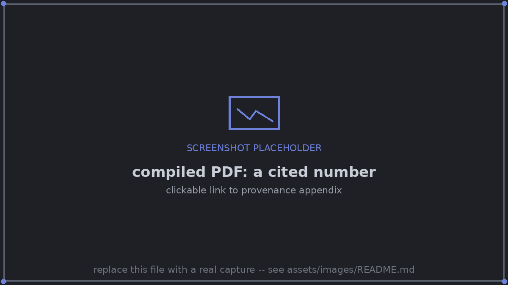
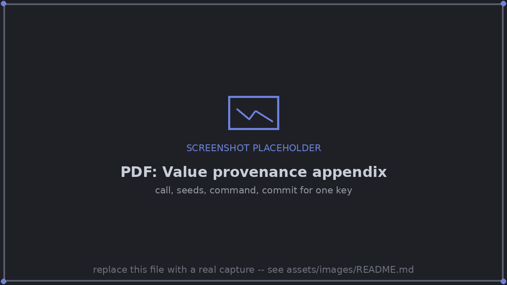

# LaTeX interface

*Summarizes [SPEC.md §7](https://github.com/dlfelps/vouch/blob/main/SPEC.md); SPEC.md is authoritative.*

## Setup

```latex
\usepackage{vouch}               % or \usepackage[short,final]{vouch}
```

`vouch.sty` is plain LaTeX2e and needs nothing beyond a current kernel. At the
end of the preamble it loads `hyperref` (unless the document already has),
`xcolor`, and, for the tooltip and note modes, `pdfcomment`. Under `final` it
loads none of them. It `\input`s the values file automatically, so no second
line is needed.

## Macros

| Macro | Renders | Notes |
|---|---|---|
| `\vouch{key}` / `\vouch[fmt]{key}` | the formatted value | Robust; works in text, math, captions, section titles and table cells. |
| `\vouchraw{key}` | the raw number, e.g. `0.93214` | Expandable, for pgfplots, `\pgfmathparse` and siunitx input. No tooltip. |
| `\vouchclaim{key}{prose}` | the prose | The tooltip shows the verdict. If the claim is false or unknown, a red marker follows unless `final`. |
| `\vouchtable{key}` | `\input` of `vouch-tables/<key>.tex` | Body rows only. |
| `\val`, `\vclaim`, `\vtable` | aliases | Only with package option `short`, and only if not already defined. |

Missing keys render the way `\ref` handles missing labels:

- **Unknown key:** `\textbf{??\detokenize{key}}`, plus a `\PackageWarning` and an end-of-document summary.
- **Pending key:** `\fbox{\scriptsize pending: key}` (or the placeholder text you configure).

## Package options

| Option | Effect |
|---|---|
| `provenance=link\|tooltip\|note\|off` | how a reader gets from a number to where it came from (default `link`) |
| `tooltip=key\|value\|full` | how much tooltip or note text says (default `full`) |
| `highlight=off\|changed` | color values whose change is not yet acknowledged (default `changed`) |
| `final` | camera-ready: no links, tooltips, notes, colors or appendix, and none of `hyperref`/`pdfcomment`/`xcolor` is loaded. Pending or unknown keys and false claims still render their markers **and** raise a LaTeX error, so a final build cannot silently ship a placeholder or a falsified claim. |
| `short` | defines the short aliases above |
| `values=FILE` | the generated values file (default `vouch-values.tex`) |

## From a number to its provenance, in the PDF

Hover tooltips turned out not to be portable across viewers, so there are four
modes:

| Mode | What the reader does | Works in |
|---|---|---|
| **`link`** (default) | clicks a number and lands on its entry in a generated **"Value provenance" appendix**; the entry links back to every page that cites it | every viewer |
| `tooltip` | hovers over a number | Acrobat, Firefox; not Chrome or Edge |
| `note` | hovers over or clicks a sticky-note icon beside each number | most desktop viewers; visually busy |
| `off` | — | — |

`examples/viewer-check/viewer-check.tex` in the repository compiles a one-page
test of all three, so a team can check the viewers it uses.

**Link mode.** In drafts, every `\vouch` value, `\vouchclaim` prose span and
generated table cell is a link, colored `vouchvalue` (a muted blue). At the end
of the draft, or where `\vouchprovenance` is placed, the appendix lists every
cited key in order of first citation.


*A cited number, linked to its provenance appendix entry.*

Each entry shows:

- the key and its rendered value, with "cited on p. 1, 3" (each page number links back)
- the description, the raw value, and the table it belongs to (for table cells)
- for a value recorded by a tracked function: the call, how long the calls took, each call's own result, and the function's definition and call sites
- run, file:line and command
- date, commit, and the run's current state (`fresh`, `STALE – models.py::f changed`, …)
- for an unacknowledged change, "CHANGED: was 93.2% (acked 2026-09-10)" in the highlight color


*One appendix entry with full call provenance.*

Notes on how PDF links work here:

- **Page numbers** come from the `.aux` file, so they appear after the second LaTeX run, as with `\ref`.
- **Links can't nest.** A claim's prose is one link; values inside it don't make links of their own (they still appear in the appendix).
- **hyperref.** If the document doesn't load it, vouch loads it with `hidelinks`. If it does, its settings win for claim prose; vouched numbers keep `vouchvalue`.

**Tooltip mode.** Values are wrapped in `pdfcomment`'s `\pdftooltip`. With
`tooltip=full`:

```
cifar.resnet.acc = 0.93214 (±0.0041, n=5)
run cifar_resnet · experiments/train.py:88
python experiments/train.py --model resnet50 --seeds 5
2026-09-12 14:03 UTC · git 0fdc530 · state: fresh
```

## Changed-value highlighting

A cited value whose change is pending is rendered in a highlight color
(configurable). Skimming the PDF then shows exactly which sentences to re-read.
Highlighting is off under `final`. See [Change notification](change-notification.md).

## The values file

`paper/vouch-values.tex` is generated, sorted and deterministic. It has no
timestamps, so an unchanged build is a byte-identical file:

```latex
% vouch-values.tex -- GENERATED by `vouch build`. Do not edit: `vouch check` detects edits.
% 38 values · 3 claims · 1 table · 1 pending
\vouch@set{cifar.resnet.acc}{}{\ensuremath{93.2 \pm 0.4}\%}{93.2 +/- 0.4\%}{<tooltip>}{0}
\vouch@raw{cifar.resnet.acc}{0.93214}
\vouch@claim{cifar.resnet_beats_vit}{1}{<tooltip>}{0}
\vouch@pending{imagenet.convnext.acc}{python experiments/train.py --dataset imagenet --model convnext}
\vouch@table{main}{vouch-tables/main.tex}
```

Every recorded key is written at its default format, so co-authors on Overleaf
can cite any recorded key without a local build; formats the paper overrides
are written in addition. The generated file's git diff is a readable record of
every number that moved.

## How the paper is scanned

- **File graph.** Starting from each `[[paper]] main`, it follows `\input`, `\include`, `\subfile`, `\import`/`\subimport`.
- **Comments** are blanked with offsets preserved. Environments listed in `lint.skip_envs` are skipped.
- **Citations found:** `\vouch[opt]{key}`, `\vouchraw{key}`, `\vouchclaim{key}{…}`, `\vouchtable{key}`, the `short` aliases, and `\includegraphics[…]{path}`.
- **Macro definitions.** A citation inside a `\newcommand`/`\renewcommand`/`\def`/`\NewDocumentCommand` body counts only if that macro is used in the document.
- **Sentences.** For change notifications, each citation's surrounding sentence is extracted, lightly de-TeXed, and capped at 240 characters.

## Source annotations (opt-in: `latex.annotate = true`)

With annotations on, `vouch build` (or `vouch sync` on demand) maintains a
managed trailing comment on every source line that cites values:

```latex
ResNet-50 reaches \vouch{cifar.resnet.acc} top-1 accuracy, \vouch{cifar.resnet_vs_vit.pts} points  % vouch: cifar.resnet.acc=93.2 ± 0.4%, cifar.resnet_vs_vit.pts=2.0
```

vouch owns only the ` % vouch: key=…` suffix. Disabling the option and running
`vouch sync --strip` removes every annotation.
