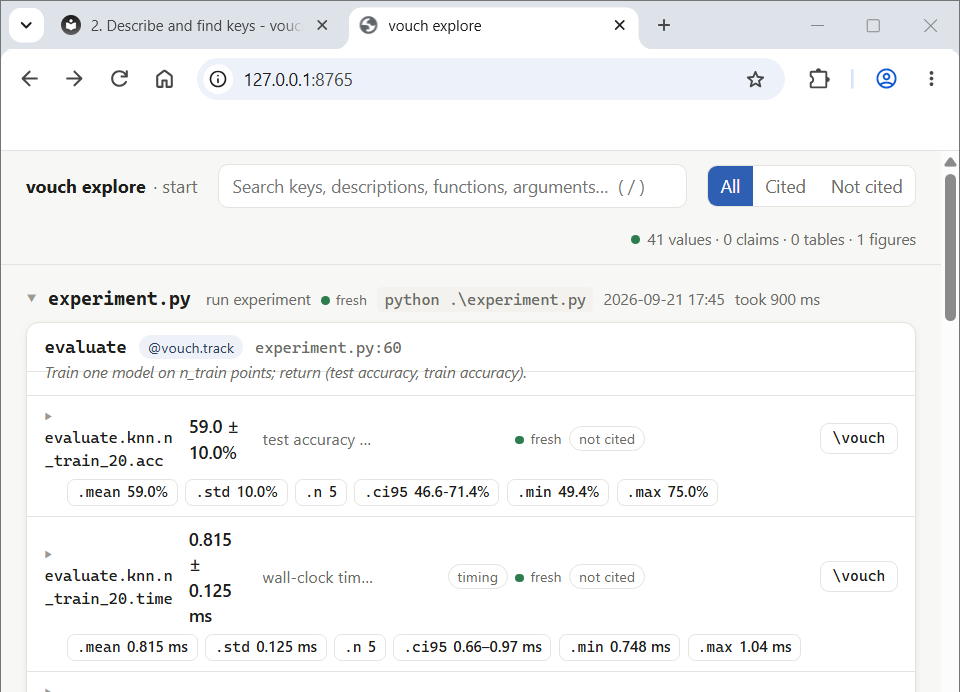

# Quickstart

Two minutes of the shape of vouch, without the full [tutorial](tutorial/index.md).
For a complete worked example (an experiment script and a paper draft, taken step
by step to a PDF), go there instead.

## 1. Record

```python
import vouch

@vouch.track(over="seed")                 # calls that differ only in seed -> mean ± std
def evaluate(dataset: str, model: str, seed: int = 0) -> dict:
    ...
    return {"acc": acc, "loss": loss}

for model in ("resnet", "vit"):
    for seed in range(5):
        evaluate("cifar", model, seed=seed)
# -> evaluate.cifar.resnet.acc, evaluate.cifar.resnet.loss, evaluate.cifar.resnet.time, ...
```

Run the script as usual: `python train.py`. Formats and descriptions for whole
families of keys go in `vouch.toml`:

```toml
[metrics]
"*.acc"  = { fmt = ".1pct", better = "higher", desc = "top-1 test accuracy" }
"*.loss" = { fmt = ".3f",   better = "lower",  desc = "test loss" }
```

Other ways to record, when a decorator doesn't fit, are in the
[recording guide](guide/recording.md).

## 2. Find the key

```console
$ vouch explore --open                  # a local page: script -> function -> keys; one click copies \vouch{...}
$ vouch search vit accuracy cifar       # ranked lookup from the terminal
$ vouch cite evaluate.cifar.vit.acc     # the exact snippet, what it renders as, its subfields
\vouch{evaluate.cifar.vit.acc}         →  90.6 ± 0.4%    (fmt .1pct)
\vouch[.2pct]{evaluate.cifar.vit.acc}  →  90.59 ± 0.44%  (fmt .2pct)
top-1 test accuracy · higher is better · fresh · run experiments.train
subfields: .mean 90.6% · .std 0.4% · .n 5 · .ci95 90.0-91.1% · .min 90.2% · .max 91.1%
context   "averages top-1 accuracy over 5 seeds, held-out test split"
```


*`vouch explore --open`: every recorded value, grouped by script then function.*

## 3. Cite

```latex
\usepackage{vouch}
...
ResNet reaches \vouch{evaluate.cifar.resnet.acc} top-1 accuracy
(\vouch[.3f]{evaluate.cifar.resnet.acc.mean} as a fraction).
\vouchclaim{resnet_wins}{ResNet outperforms ViT.}
\begin{tabular}{lr} \toprule Model & Acc \\ \midrule \vouchtable{main} \bottomrule \end{tabular}
```

```console
$ vouch build
$ latexmk -pdf paper/main.tex
```

## 4. Check

```console
$ vouch check
vouch check: paper/main.tex · 16 citations · 1/1 cited runs fresh
✓ OK
```

`vouch check` never runs your code. It fails when a cited key doesn't exist, the
code behind a cited run changed since the run, a claim no longer holds, a figure
is stale, or the generated files are out of date. Put it in a
[pre-commit hook and CI](guide/workflow-integration.md).

**Next:** the full [tutorial](tutorial/index.md) walks through all of this on a
real two-second experiment, including what happens when the code changes under
you.
