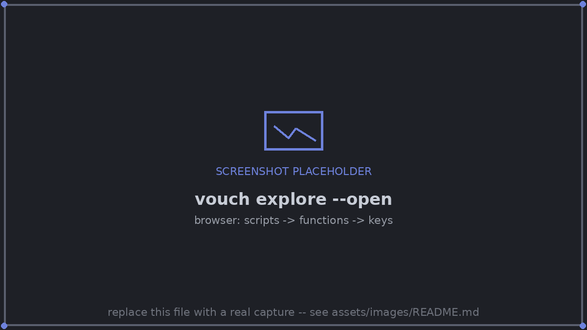

# 2. Describe the metrics, then find the key

<!-- kept in sync manually with examples/tutorial/README.md; update both -->

## Describe each family once

vouch asked for descriptions. Describe each family of keys once, in `vouch.toml`:

```toml
[metrics]
"*.acc"       = { fmt = ".1pct", better = "higher", desc = "test accuracy of {1} ({2}), mean and std over seeds" }
"*.train_acc" = { fmt = ".1pct", better = "higher", desc = "training accuracy of {1} ({2}), mean and std over seeds" }
```

`fmt = ".1pct"` prints 0.873 as 87.3%, and `{1}`, `{2}` are key segments. You
don't need to re-run anything: formats and descriptions are applied when values
are read, not when they are recorded.

## Find the key you need

```console
$ vouch explore --open
```

This opens a local page listing every value by script, then function. One click
copies the LaTeX that cites it.


*`vouch explore --open`: the left side lists scripts and functions; the right side
lists that function's keys, each with a button that copies its citation.*

From the terminal:

```console
$ vouch search "knn test accuracy 640"
evaluate.knn.n_train_640.acc           87.3 ± 1.4%   test accuracy of knn (n_train_640), mean and std over seeds   (experiment)
evaluate.knn.n_train_640.train_acc     87.4 ± 0.9%   training accuracy of knn (n_train_640), mean and std over se   (experiment)
...
$ vouch cite evaluate.knn.n_train_640.acc
\vouch{evaluate.knn.n_train_640.acc}         →  87.3 ± 1.4%    (fmt .1pct)
\vouch[.2pct]{evaluate.knn.n_train_640.acc}  →  87.30 ± 1.41%    (fmt .2pct)
test accuracy of knn (n_train_640), mean and std over seeds · higher is better · fresh · run experiment
subfields: .mean 87.3% · .std 1.4% · .n 5 · .ci95 85.5-89.1% · .min 85.8% · .max 89.1%
context   "Train one model on n_train points; return (test accuracy, train accuracy)."
```

`evaluate` already had a docstring (it's how `knn`/`linear` are told apart in
this tutorial's `experiment.py`), so `vouch cite` and `vouch search` show it
back as `context:` -- read fresh from the source, a sanity check that
`evaluate.knn.n_train_640.acc` really is what its name suggests, not a
description vouch made up.

After the first `vouch build`, `.vouch/CATALOG.md` lists every key on one line
each. It's the file to give an LLM agent that is writing the paper with you — see
[LLM & agents](../llm/index.md).

Full reference: [`vouch explore`](../cli/inspect.md), [`vouch search`/`vouch cite`](../cli/inspect.md).

**Next:** [3. Cite and build](03-cite-and-build.md).
