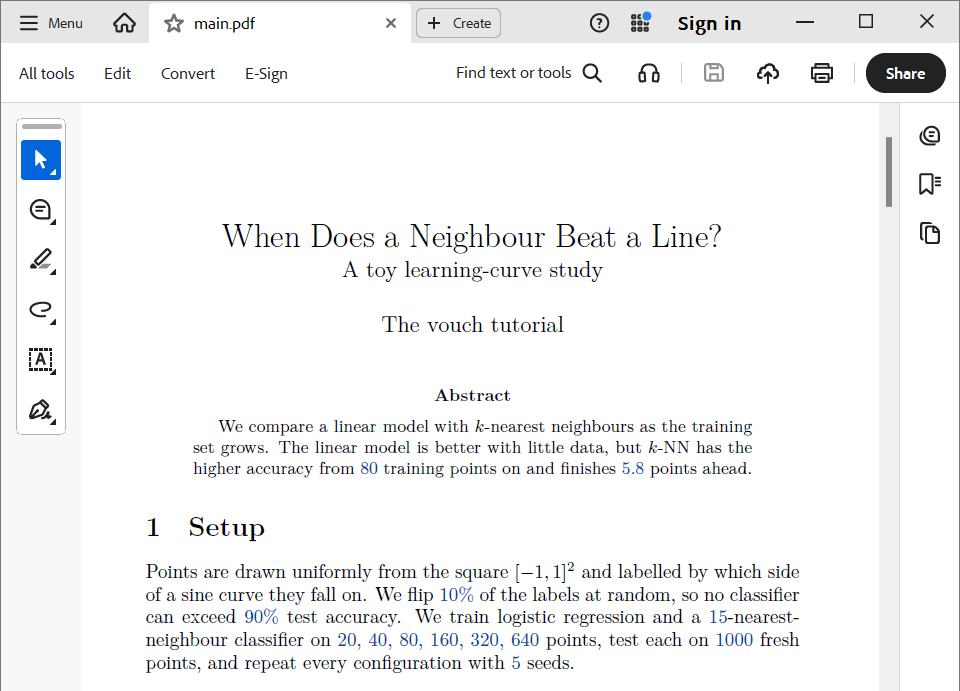

# 3. Write the numbers into the paper, and the figure

<!-- kept in sync manually with examples/tutorial/README.md; update both -->

## Write the numbers into the paper

Every number is `\vouch{key}`. These are from the Setup and Results sections of
`finished/paper/main.tex`:

| You write | The PDF shows |
|---|---|
| `\vouch{evaluate.knn.n_train_640.acc}` | 87.3 ± 1.4% |
| `\vouch{evaluate.knn.n_train_640.acc.std}` | 1.4% |
| `\vouch{evaluate.linear.n_train_640.train_acc}` | 80.5 ± 1.6% |
| `\vouch{experiment.param.k}` | 15 |
| `\vouch{experiment.param.sizes}` | 20, 40, 80, 160, 320, 640 |
| `\vouch[.0pct]{experiment.param.noise}` | 10% (the optional argument picks a format) |

```latex
We flip \vouch[.0pct]{experiment.param.noise} of the labels at random, ...
We train logistic regression and a \vouch{experiment.param.k}-nearest-neighbour
classifier on \vouch{experiment.param.sizes} points, test each on
\vouch{experiment.param.n_test} fresh points, and repeat every configuration with
\vouch{experiment.param.seeds} seeds.
```

Then build the generated values and compile as usual:

```console
$ vouch build
$ cd paper && latexmk -pdf main.tex
```

`vouch build` writes `paper/vouch-values.tex`, which `vouch.sty` reads. Commit it
too, so co-authors and Overleaf can compile the paper without running anything.


*Every `\vouch{...}`-produced number in the draft PDF is a link to the "Value
provenance" appendix (next step).*

## The figure

Include it as always:

```latex
\includegraphics[width=0.75\linewidth]{figures/learning_curve.pdf}
```

vouch knows which run saved it, and where:

```console
$ vouch trace paper/figures/learning_curve.pdf
paper/figures/learning_curve.pdf   figure
  saved     experiment.py:98   in run experiment (fresh)
  command   python experiment.py
  when      2026-09-19 13:05 UTC
  file      as the run saved it
  cited     paper/main.tex:47
```

`vouch check` fails if the code behind the figure has changed since it was saved,
or if the file no longer matches what the run saved. The caption can cite values
too, like any other text. vouch saves tracked figures without the timestamp
matplotlib normally embeds, so re-running unchanged code gives a byte-identical
file.

Full reference: [LaTeX interface](../guide/latex.md).

**Next:** [4. Derived values and tables](04-derived-and-tables.md).
