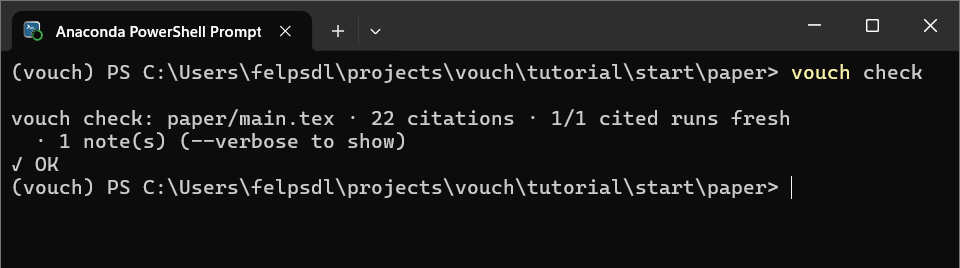
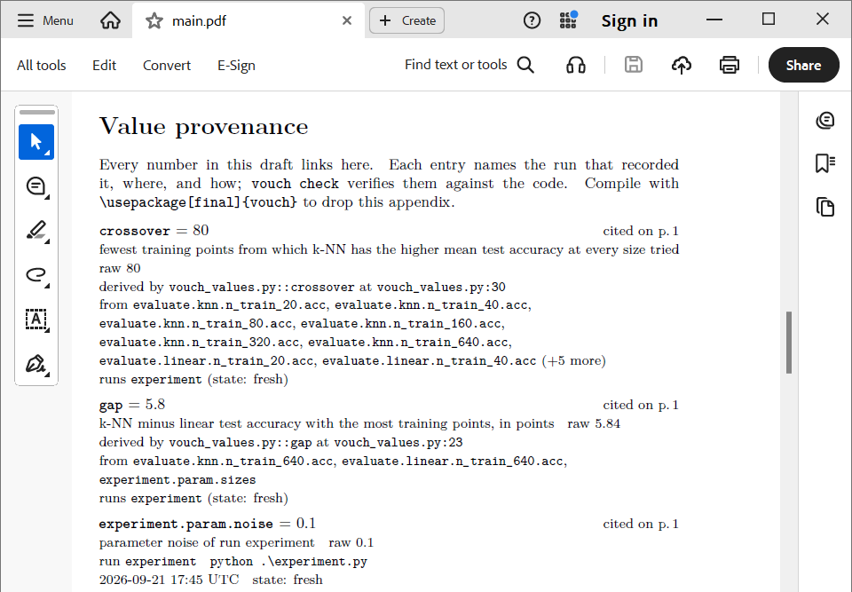

# 5. Check it and read it

<!-- kept in sync manually with examples/tutorial/README.md; update both -->

```console
$ vouch build
vouch build: evaluated vouch_values.py (6 definitions) -> .vouch/derived.json
vouch build: paper/main.tex
  wrote: paper/vouch-values.tex (284 values, 2 claims, 1 tables; 22 citations)
$ vouch check
vouch check: paper/main.tex · 22 citations · 1/1 cited runs fresh
  · 1 note(s) (--verbose to show)
✓ OK
```


*`vouch check`, green: every cited key exists, every cited run is fresh, and
every claim holds.*

`vouch check` never runs your code, and takes under a second. It passes only if:

- every cited key exists
- every cited value comes from a run whose code hasn't changed since
- every claim holds
- the figure is fresh
- the generated files are up to date

Put it in a pre-commit hook (`vouch hook install`) and in CI
(`vouch check --strict`) — see [Workflow integration](../guide/workflow-integration.md).

In the compiled PDF, every number is a link to a "Value provenance" appendix,
which shows:

- what the number is, and the call that produced it
- each seed's result, and how long each call took
- the command and the commit


*One appendix entry: the call that produced the value, each seed's result, the
command, and the commit.*

`vouch trace` shows the same from the terminal:

```console
$ vouch trace evaluate.knn.n_train_640.acc
evaluate.knn.n_train_640.acc = 0.873 +/- 0.01414213562 (n=5)   → "87.3 +/- 1.4%"   (fmt .1pct)
  desc      test accuracy of knn (n_train_640), mean and std over seeds   · better: higher
  recorded  experiment.py:60   in run experiment
  by        evaluate(model=knn, n_train=640) over seed=0..4 (5 calls)
  time      took 96.4 ± 20.7 ms per call, 482 ms in all
  each call seed=0: 0.858 (98.4 ms); seed=1: 0.882 (125 ms); seed=2: 0.891 (66.3 ms); seed=3: 0.874 (95.6 ms); seed=4: 0.86 (96.9 ms)
  called at experiment.py:78
  command   python experiment.py
  code      6 units in 1 file(s), tracked by function · fresh   (--code to list)
  feeds     crossover (derived) · gap (derived) · knn_wins_large (claim) · learning_curve (table)
  cited     paper/main.tex:36
```

Full reference: [Checks and lints](../guide/checks-and-lints.md).

**Next:** [6. When the code changes](06-when-code-changes.md).
