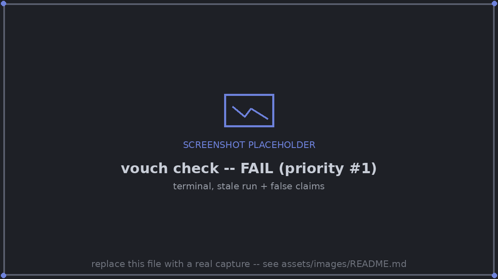

# 6. When the code changes

<!-- kept in sync manually with examples/tutorial/README.md; update both -->

This is the step that shows what vouch is actually for.

Change `K = 15` to `K = 1` in `experiment.py`. `vouch check` notices before
anything is re-run:

```console
$ vouch check
vouch check: paper/main.tex · 22 citations · 0/1 cited runs fresh
  ✗ stale          run experiment: experiment.py::<module> changed since the run; the paper cites crossover, gap, experiment.param.noise, best_possible (+14 more)
                   fix: python experiment.py   (or, if the result cannot have changed: vouch accept experiment --why "...")
  ✗ figure-stale   paper/figures/learning_curve.pdf comes from run experiment, which is stale
FAILED: 2 error(s), 0 warning(s)
```

Only real code changes count. Editing a comment or a docstring, or reformatting,
leaves the run fresh. Re-run the experiment, then build:

```console
$ python experiment.py
$ vouch build
  ✗ derive-error   crossover is cited here, but its definition failed (the derive-error at vouch_values.py:30)
  ✗ derive-error   crossover: ValueError: k-NN is not ahead with the most training points (at vouch_values.py:38)

20 CHANGED VALUES — re-read the sentences below

  NOW FALSE   knn_wins_large   HOLDS (0.873 > 0.8146) → FALSE (0.7842 > 0.8146)   (the claim no longer holds)
    paper/main.tex:35  "\vouchclaim{knn_wins_large}{With the most, $k$-NN is better}: it reaches ..."

  NOW FALSE   linear_wins_small   HOLDS (0.7806 > 0.5904) → FALSE (0.7806 > 0.7866)   (the claim no longer holds)
    paper/main.tex:32  "\vouchclaim{linear_wins_small}{With the fewest training points the linear model is better}: ..."

  SUSPICIOUS  gap   5.8 → -3.0   (Δ -8.88, -152.1%; sign flip; large move (152%))
    paper/main.tex:16  "The linear model is better with little data, but $k$-NN has the higher accuracy from ..."

  SUSPICIOUS  table learning_curve   12 cells changed, 8 suspicious
    ! 20.gap   -19.0 → +0.6   (sign flip; large move (103%))
    ! 20.knn   59.0 +/- 10.0% → 78.7 +/- 2.5%   (large move (33%))
    ...
    paper/main.tex:64  "\vouchtable{learning_curve}"
  ...
```

A nearest-neighbour classifier with k = 1 memorises every flipped label. The
paper's two claims are now false, and so is the abstract's premise: k-NN is no
longer ahead with the most training points, so `crossover` has no value. The
PDF would have printed the new numbers without complaint, but the sentences
around them would be wrong. vouch lists those sentences, and `vouch check` now
fails:

```console
$ vouch check
  ✗ derive-error   crossover is cited here, but its definition failed ...
  ✗ false-claim    claim linear_wins_small no longer holds (...): 0.7806 > 0.7866
  ✗ false-claim    claim knn_wins_large no longer holds (...): 0.7842 > 0.8146
  ! suspicious     gap: 5.8 -> -3.0 (POSSIBLE PROBLEM: sign flip; large move (152%))
  ! suspicious     table learning_curve: 12 cell(s) changed, 8 POSSIBLE PROBLEM(s): ...
                   fix: re-read the table and what the text says about it, then: vouch ack learning_curve
  ...
FAILED: 4 error(s), 9 warning(s)
```


*The moment vouch exists for: `K = 15` becomes `K = 1`, two claims flip false, and
`vouch check` fails before the wrong PDF ever ships.*

After a change like this you have two options:

- **Keep the new result.** Rewrite the sentences and the claims until they are
  true again. Then acknowledge each change you have re-read, with
  `vouch ack KEY`, `vouch ack learning_curve` for a whole table, or
  `vouch review` to step through them. vouch records who acknowledged each change
  and when.
- **Undo the change.** Set `K = 15` again, re-run and rebuild. The values return
  to the ones you had acknowledged, and nothing is pending:

```console
$ python experiment.py && vouch build && vouch check
...
✓ OK
```

Two commands make this loop shorter:

- **`vouch diff`** shows what a re-run did to *every* recorded value, cited
  or not, compared with your last commit. It lists old → new, the size and
  direction of each move, and whether it got better or worse (for keys with
  `better = "higher"` or `"lower"`). `vouch changes` only lists the cited
  values waiting for someone to re-read their sentences.
- **`vouch watch`**, left running in a terminal, rebuilds whenever a run
  records new values or you save the paper or `vouch_values.py`. You no longer
  have to remember `vouch build`, and after each rebuild it prints the values
  that moved.

```console
$ vouch diff                 # HEAD vs the values on disk now
$ vouch watch                # rebuild on every new result; Ctrl-C to stop
```

Full reference: [Change notification](../guide/change-notification.md),
[Freshness](../guide/freshness.md).

**Next:** [7. Submitting](07-submitting-and-next.md).
