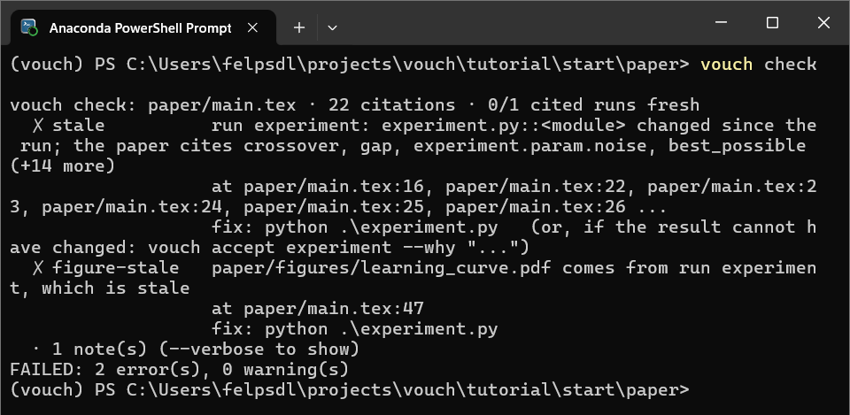

# 6. When the code changes

<!-- kept in sync manually with examples/tutorial/README.md; update both -->

This is the step that shows what vouch is actually for.

First, commit what you have. Later in this step `vouch diff` compares the
values on disk with a git commit, so it needs one to compare with:

```console
$ git init
$ git add -A
$ git commit -m "results with K = 15"
```

If the project is already in a git repository, just commit.

Now change `K = 15` to `K = 1` in `experiment.py`. `vouch check` notices before
anything is re-run:

```console
$ vouch check
vouch check: paper/main.tex · 22 citations · 0/1 cited runs fresh
  ✗ stale          run experiment: experiment.py::<module> changed since the run; the paper cites crossover, gap, experiment.param.noise, best_possible (+14 more)
                   fix: python experiment.py   (or, if the result cannot have changed: vouch accept experiment --why "...")
  ✗ figure-stale   paper/figures/learning_curve.pdf comes from run experiment, which is stale
FAILED: 2 error(s), 0 warning(s)
```

Only real code changes count. Editing a comment or a docstring, or reformatting,
leaves the run fresh. Re-run the experiment, then build:

```console
$ python experiment.py
$ vouch build
  ✗ derive-error   crossover is cited here, but its definition failed (the derive-error at vouch_values.py:30)
  ✗ derive-error   crossover: ValueError: k-NN is not ahead with the most training points (at vouch_values.py:38)

20 CHANGED VALUES — re-read the sentences below

  NOW FALSE   knn_wins_large   HOLDS (0.873 > 0.8146) → FALSE (0.7842 > 0.8146)   (the claim no longer holds)
    paper/main.tex:35  "\vouchclaim{knn_wins_large}{With the most, $k$-NN is better}: it reaches ..."

  NOW FALSE   linear_wins_small   HOLDS (0.7806 > 0.5904) → FALSE (0.7806 > 0.7866)   (the claim no longer holds)
    paper/main.tex:32  "\vouchclaim{linear_wins_small}{With the fewest training points the linear model is better}: ..."

  SUSPICIOUS  gap   5.8 → -3.0   (Δ -8.88, -152.1%; sign flip; large move (152%))
    paper/main.tex:16  "The linear model is better with little data, but $k$-NN has the higher accuracy from ..."

  SUSPICIOUS  table learning_curve   12 cells changed, 8 suspicious
    ! 20.gap   -19.0 → +0.6   (sign flip; large move (103%))
    ! 20.knn   59.0 +/- 10.0% → 78.7 +/- 2.5%   (large move (33%))
    ...
    paper/main.tex:64  "\vouchtable{learning_curve}"
  ...
```

A nearest-neighbour classifier with k = 1 memorises every flipped label. The
paper's two claims are now false, and so is the abstract's premise: k-NN is no
longer ahead with the most training points, so `crossover` has no value. The
PDF would have printed the new numbers without complaint, but the sentences
around them would be wrong. vouch lists those sentences, and `vouch check` now
fails:

```console
$ vouch check
  ✗ derive-error   crossover is cited here, but its definition failed ...
  ✗ false-claim    claim linear_wins_small no longer holds (...): 0.7806 > 0.7866
  ✗ false-claim    claim knn_wins_large no longer holds (...): 0.7842 > 0.8146
  ! suspicious     gap: 5.8 -> -3.0 (POSSIBLE PROBLEM: sign flip; large move (152%))
  ! suspicious     table learning_curve: 12 cell(s) changed, 8 POSSIBLE PROBLEM(s): ...
                   fix: re-read the table and what the text says about it, then: vouch ack learning_curve
  ...
FAILED: 4 error(s), 9 warning(s)
```


*The moment vouch exists for: `K = 15` becomes `K = 1`, two claims flip false, and
`vouch check` fails before the wrong PDF ever ships.*

## What else did the re-run change?

`vouch build` and `vouch check` list the values the paper **cites**, because
those are the ones whose sentences need re-reading. But the run recorded 36
values, and most of them never reach the paper. `vouch diff` compares every
recorded value with your last commit:

```console
$ vouch diff
vouch diff: HEAD → working tree · 41 changed · 0 added · 1 removed · 29 unchanged

  run experiment
      ● evaluate.knn.n_train_640.acc         87.3 +/- 1.4% → 78.4 +/- 1.3%   ↓ Δ -8.88 pts, -10.2% relative   worse   ! large move (10%)
      ● evaluate.knn.n_train_20.acc          59.0 +/- 10.0% → 78.7 +/- 2.5%   ↑ Δ +19.6 pts, +33.2% relative   better   ! large move (33%)
      ● experiment.param.k                   15 → 1   ↓ Δ -14, -93.3%   ! order-of-magnitude change; large move (93%)
        evaluate.knn.n_train_40.acc          77.6 +/- 2.7% → 73.9 +/- 2.7%   ↓ Δ -3.68 pts, -4.7% relative   worse
        ...
        evaluate.knn.n_train_20.train_acc    76.0 +/- 5.5% → 100.0 +/- 0.0%   ↑ Δ +24 pts, +31.6% relative   better   ! large move (32%)
        ...
  derived
      ● gap                                  5.8 → -3.0   ↓ Δ -8.88, -152.1%   worse   ! sign flip; large move (152%)
  claims
      ● knn_wins_large                       HOLDS → FALSE   worse   ! NOW FALSE; margin 0.0717 → -0.0373
      ● linear_wins_small                    HOLDS → FALSE   worse   ! NOW FALSE; margin 0.322 → -0.00763
  table learning_curve
      ● learning_curve.20.gap                -19.0 → +0.6   ↑ Δ +19.62, +103.2%   ! sign flip; large move (103%)
        ...
  removed
    - ● crossover                            80
  figures
    ~ ● paper/figures/learning_curve.pdf     the figure file changed (run experiment)

  ● cited in the paper; `vouch changes` lists the sentences to re-read
```

How to read a line:

- **old → new**, as the paper would print it.
- **↑ / ↓ and Δ**: the direction and size of the move. For percentages, Δ is
  in percentage points; for a mean ± std, it is the change in the mean.
- **better / worse** appears because `vouch.toml` says `better = "higher"`
  for accuracies. A claim that stops holding is always `worse`.
- **●** marks keys the paper cites. **!** lists the same warning signs
  `vouch build` uses: sign flip, large move, and so on.

`vouch diff` only reads. It doesn't acknowledge anything or touch the
baseline, so you can run it as often as you like.

The full list is long, partly because timings (`*.time`) differ on every run.
`--key` narrows it to keys that contain a substring or match a glob. Try the
training accuracies, which the paper doesn't cite:

```console
$ vouch diff --key train_acc
vouch diff: HEAD → working tree · 6 changed · 0 added · 0 removed · 6 unchanged

  run experiment
        evaluate.knn.n_train_20.train_acc    76.0 +/- 5.5% → 100.0 +/- 0.0%   ↑ Δ +24 pts, +31.6% relative   better   ! large move (32%)
        evaluate.knn.n_train_40.train_acc    82.5 +/- 5.0% → 100.0 +/- 0.0%   ↑ Δ +17.5 pts, +21.2% relative   better   ! large move (21%)
        evaluate.knn.n_train_80.train_acc    86.0 +/- 2.6% → 100.0 +/- 0.0%   ↑ Δ +14 pts, +16.3% relative   better   ! large move (16%)
        evaluate.knn.n_train_160.train_acc   86.0 +/- 3.9% → 100.0 +/- 0.0%   ↑ Δ +14 pts, +16.3% relative   better   ! large move (16%)
        evaluate.knn.n_train_320.train_acc   89.3 +/- 2.6% → 100.0 +/- 0.0%   ↑ Δ +10.7 pts, +12.0% relative   better   ! large move (12%)
        evaluate.knn.n_train_640.train_acc   87.4 +/- 0.9% → 100.0 +/- 0.0%   ↑ Δ +12.6 pts, +14.4% relative   better   ! large move (14%)
```

This explains the drop in test accuracy. With k = 1, every training point is
its own nearest neighbour, so k-NN gets 100% on the data it trained on, noisy
labels included: it has memorised them. Notice that vouch calls this `better`.
The label only follows the direction you declared for the key; deciding what
a move means is still your job.

A few other forms you'll use:

```console
$ vouch diff --cited                # only what the paper cites
$ vouch diff main                   # this branch against main
$ vouch diff HEAD~3 HEAD            # two commits
$ vouch diff main --md diff.md      # a Markdown report for a pull request
```

## Keep the result, or undo the change

After a change like this you have two options:

- **Keep the new result.** Rewrite the sentences and the claims until they are
  true again. Then acknowledge each change you have re-read, with
  `vouch ack KEY`, `vouch ack learning_curve` for a whole table, or
  `vouch review` to step through them. vouch records who acknowledged each change
  and when.
- **Undo the change.** Set `K = 15` again, re-run and rebuild. The values return
  to the ones you had acknowledged, and nothing is pending:

```console
$ python experiment.py && vouch build && vouch check
...
✓ OK
```

`vouch diff` confirms the undo. Every result is back to what you committed;
only the timings differ, so leave them out:

```console
$ vouch diff --key '*acc'
vouch diff: HEAD → working tree · 0 changed · 0 added · 0 removed · 24 unchanged
```

## Leave `vouch watch` running

So far you've run `vouch build` after every change. `vouch watch` does it for
you: leave it running in a second terminal and it rebuilds whenever a run
records new values or you save the paper, `vouch_values.py` or `vouch.toml`.
After each rebuild it prints what moved, in the same format as `vouch diff`.
Had it been running while you undid the change above, this is what it would
have printed when `python experiment.py` finished:

```console
$ vouch watch --quiet
[18:28:19] vouch watch: building, then watching for new values (Ctrl-C to stop)
  wrote 3 file(s)

[18:29:02] .vouch/runs/experiment.json changed
  42 value(s) moved since the last build:
    run experiment
        ● evaluate.knn.n_train_20.acc          78.7 +/- 2.5% → 59.0 +/- 10.0%   ↓ Δ -19.6 pts, -24.9% relative   worse   ! large move (25%)
        ● evaluate.knn.n_train_640.acc         78.4 +/- 1.3% → 87.3 +/- 1.4%   ↑ Δ +8.88 pts, +11.3% relative   better   ! large move (11%)
        ...
  wrote 3 file(s)
```

It never runs the experiment for you; you still run `python experiment.py`.
Add `--then "latexmk -pdf -cd paper/main.tex"` to recompile the PDF after each
rebuild too.

Full reference: [Comparing runs and live rebuilds](../guide/diff-and-watch.md),
[Change notification](../guide/change-notification.md),
[Freshness](../guide/freshness.md).

**Next:** [7. Submitting](07-submitting-and-next.md).
